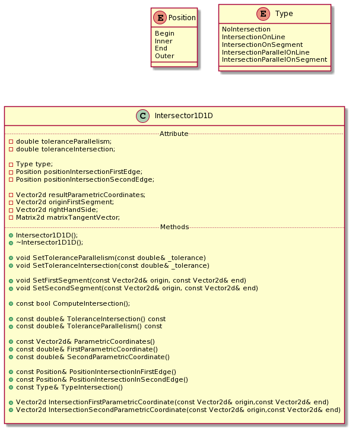

# Intersector1D1D 

The Intersector1D1D compute the intersections between two 1D geomertrical objects: straight lines or segments.

The straight lines or segments are expressed by the vector equation r: x_0 + s * t and r: x_0 + s * (x_1 - x_0) respectively;

s is the curvilinear coordinate

## Example 

Defined two straight lines:

* x1_0 = (0.0,0.0) and a direction t1_0 = (1.0,1.0);
* x2_0 = (2.0,0.0) and a direction t2_0 = (-1.0,-1.0);

* The intersection point is P = (1.0,1.0)
* The Position for the first straight Line is Inner
* The Position for the second straight Line is Inner
* The Type intersection is IntersectionOnSegment

## Requirements

Write a software which computes the intersection between two 1D geometrical objects.

The class Intersector1D1D has to recognize the type of the intersection and the position of the intersection in each geometrical object

-The enumeration Position contains: Begin, End, Inner, Outer and gives the information about the position of the intersection point
in each geometrical object.

* Begin means the curvilinear coordinate is equal to 0
* End means the curvilinear coordinate is equal to 1
* Inner means the curvilinear coordinate is between 0 and 1
* Outer means the curvilinear coordinate is less than 0 or greater than 1

-The enuration Type contains: IntersectionOnSegment, IntersectionOnLine, ParallelIntersectionOnSegment, ParallelIntersectionOnLine,
NoIntersection and gives the information about the intersection type refers to the first straight line or segment.

* IntersectionOnSegment means the position of the intersection is inside the segment
* IntersectionOnLine means the position of the intersection is on the extension of the segment
* ParallelIntersectionOnSegment means the position of the intersections is inside the segment
* ParallelIntersectionOnLine means the position of the intersections is on the extension of the segment
* NoIntersection means there is no intersection between two geometric objects

To recognize if the curvilinear coordinate is equale to 0 or 1, introudce a tolerance equal to 1.0E-7.
To recognize if two segments or straight lines are parallel, introduce a tolerance equal to 1.0E-7.

