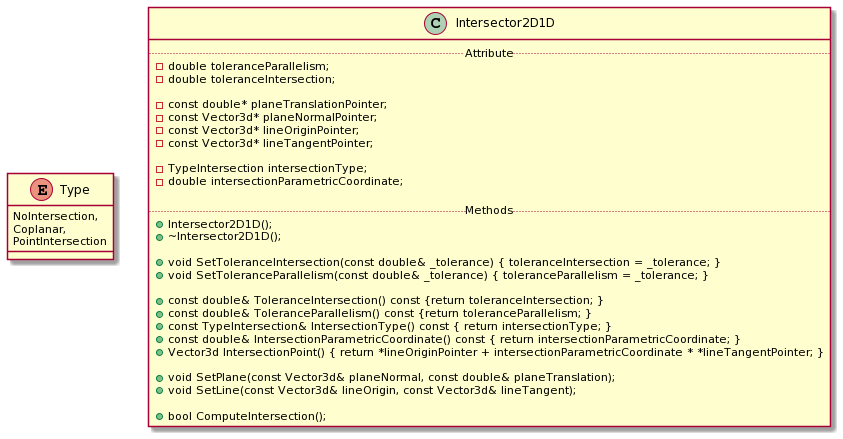
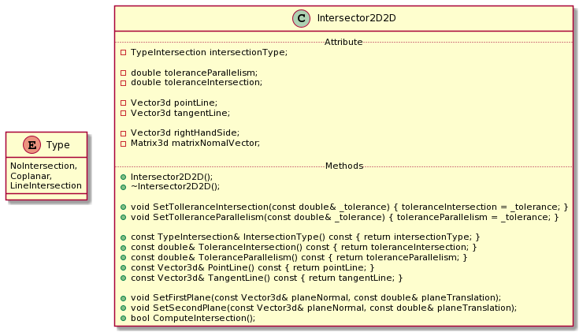

# Intersector2D1D 

The Intersector2D1D compute the intersections between a straight lines or segments and a plane.

The straight line and the plane are expressed by the vector equation r: x_0 + s * t and Pi: N^t * (x - x_0) = 0 or Pi: N^t * x - d = 0 respectively;

s is the curvilinear coordinate and x_0 is one point in r or in Pi. d is the translation term and represents the scalar product between N and x_0

## Requirements

Write a software which computes the intersection between one 1D geometrical object and one 2D geometrical object.

The class Intersector1D1D has to recognize the type of the intersection and the position of the intersection in each geometrical object

-The enumeration Type contains: NoIntersection, Coplanar, PointIntersection and gives the informations about the intersection type 

* Coplanar means the straight line or the segment is contained in the plane
* PointIntersection means the straight line or the segment intersects the plane in one point
* NoIntersection means there is no intersection between two geometric objects

To recognize if the origin point of the straight line is in the plane, introduce a tolerance equal t 1.0E-7.
To recognize if the segment or straight line is contained in the plane, introduce a tolerance equal to 1.0E-7.

# Intersector2D2D 

The Intersector2D1D compute the intersections between two plane.

The planes are expressed by the vector equation Pi_1: N^t * (x - x_0) or Pi: N^t * x - d = 0

## Requirements

Write a software which computes the intersection between two planes

The class Intersector2D2D has to recognize the type of the intersection

-The enumeration Type contains: NoIntersection, Coplanar, LineIntersection and gives the informations about the intersection type 

* Coplanar means the planes are the same plane
* LineIntersection means the two plane intersects each other
* NoIntersection means there is no intersection between the two planes

To recognize if the translation terms coincide, introduce a tolerance equal to  1.0E-7.
To recognize if the normals are parallel, intrdouce a tolerance equal to 1.0E-5.

