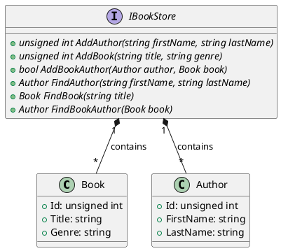

```plantuml
@startuml
class Book {
  +Id: unsigned int
  +Title: string
  +Genre: string
}

class Author {
  +Id: unsigned int
  +FirstName: string
  +LastName: string
}

interface IBookStore {
  +{abstract} unsigned int AddAuthor(string firstName, string lastName)
  +{abstract} unsigned int AddBook(string title, string genre)
  +{abstract} bool AddBookAuthor(Author author, Book book)
  +{abstract} Author FindAuthor(string firstName, string lastName)
  +{abstract} Book FindBook(string title)
  +{abstract} Author FindBookAuthor(Book book)
}

IBookStore "1" *-- "*" Book : contains
IBookStore "1" *-- "*" Author : contains
@enduml
```