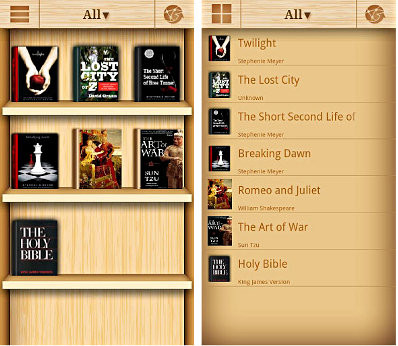
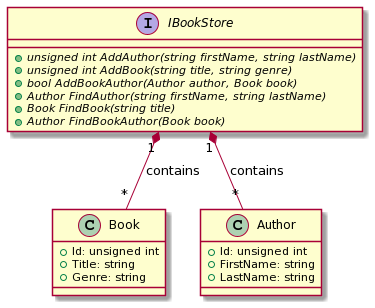

# Bookstore

A famous Bookstore has already a database to check the available books.

## Requirements

A bookstore application already exists.

The request from the client is to fix some problems (__bugs__) that the application seems to have.

## Documentation

The bookstore applications is implemented using the following class diagram:

* The function `AddAuthor` adds an author inside the BookStore database:
    * The author is identified by fistName + lastName
    * The author is identified inside the database by an unique id starting from 0 and generated by the function
    * If the author already exists its unique id shall be returned
* The function `AddBook` adds a book inside the BookStore database:
    * The book is identified by the title
    * The book is identified by an unique id starting from 0 and generated by the function
    * If the book already exists its unique id shall be returned
* The function `AddBookAuthor` connects a book to its author.
    * It returns true if the operation is successful, false otherwise
* The function `FindAuthor` finds the author by first and last name
    * If the author is not found an exception `Author not found` shall be returned
* The function `FindBook` finds the book by title
    * If the book is not found an exception `Book not found` shall be returned
* The function `FindBookAuthor` finds the author of a particular book
    *  If the author is not found an exception `Author not found` shall be returned