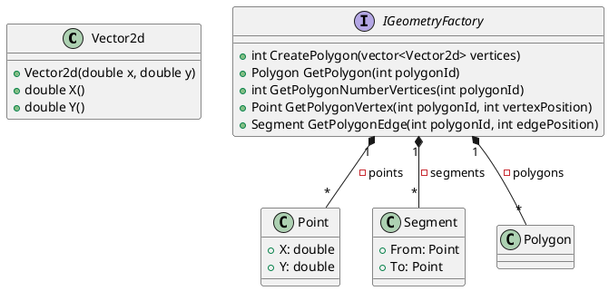

```plantuml
@startuml

class Vector2d {
  +Vector2d(double x, double y)
  +double X()
  +double Y()
}

class Point {
  +X: double
  +Y: double
}

class Segment {
  +From: Point
  +To: Point
}

class Polygon { }

interface IGeometryFactory {
  +int CreatePolygon(vector<Vector2d> vertices)
  +Polygon GetPolygon(int polygonId)
  +int GetPolygonNumberVertices(int polygonId)
  +Point GetPolygonVertex(int polygonId, int vertexPosition)
  +Segment GetPolygonEdge(int polygonId, int edgePosition)
}

IGeometryFactory "1" *-- "*" Point: -points
IGeometryFactory "1" *-- "*" Segment: -segments
IGeometryFactory "1" *-- "*" Polygon: -polygons

@enduml
```