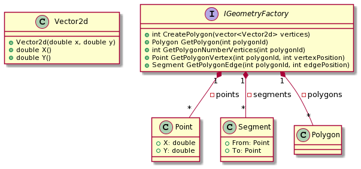
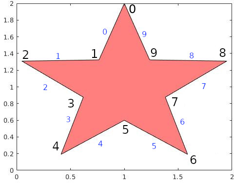

# Geometry Factory

Usually in Computational Science libraries you can find a geometry factory class used to create all the geometric objects.
This class is also responsible for the memory management of the geometrical objects created.

## Requirements

Your group is working on the Computational Science library documented in the following

The request from the users is to fix some problems (__bugs__) that the library seems to have.

## Documentation

The `IGeometryFactory` is implemented as follow:

* function `CreatePolygon` creates an object of class `Polygon` given the list of vertices:
    * the list of vertices is counterclockwise
    * each vertex in input is a `Vector2d` element
    * the function return the unique identifier of the polygon in the factory starting from 1
* function `GetPolygon` return a `Polygon` reference corresponding to the unique identifier `polygonId`
    * if the polygon is not found an exception `Polygon not found` is thrown
* function `GetPolygonNumberVertices` is able to recover the total number of vertices in the polygon corresponding to the unique identifier `polygonId`
    * if the polygon is not found an exception `Polygon not found` is thrown
* function `GetPolygonVertex` is able to recover the vertex at position `vertexPosition` (starting from 0) in the polygon corresponding to the unique identifier `polygonId`
    * if the polygon is not found an exception `Polygon not found` is thrown
    * if the position exceeds the total number of vertices of the polygon then an exception `Vertex not found` is thrown
* function `GetPolygonEdge` is able to recover the edge at position `edgePosition` (starting from 0) in the polygon corresponding to the unique identifier `polygonId`
    * if the polygon is not found an exception `Polygon not found` is thrown
    * if the position exceeds the total number of edges of the polygon then an exception `Edge not found` is thrown

The following image shows an example of Polygon:

