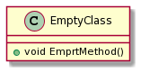
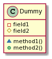

# Empty Projects

This folder is used for the configuration of empty C++ or Python projects

## Image Example

## Documentation Links

* [markdown](https://confluence.atlassian.com/bitbucketserver/markdown-syntax-guide-776639995.html)
* [plantuml](https://plantuml.com/)
* [class-diagram](https://plantuml.com/class-diagram)
* [plantuml creator](https://www.planttext.com/)