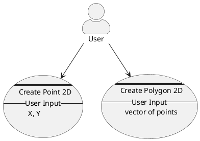

```plantuml
@startuml

skinparam actorStyle awesome

"User" as User

usecase "==\nCreate Point 2D\n-- User Input --\nX, Y" as CreatePoint
usecase "==\nCreate Polygon 2D\n-- User Input --\nvector of points" as CreatePolygon

User --> (CreatePoint)
User --> (CreatePolygon)
@enduml
```