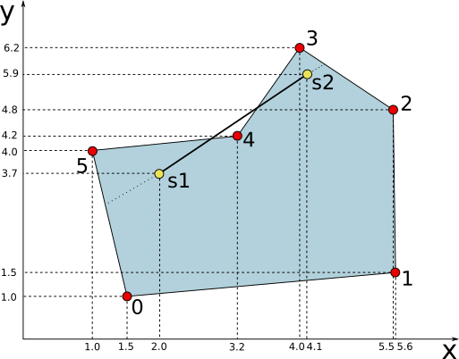
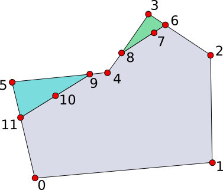
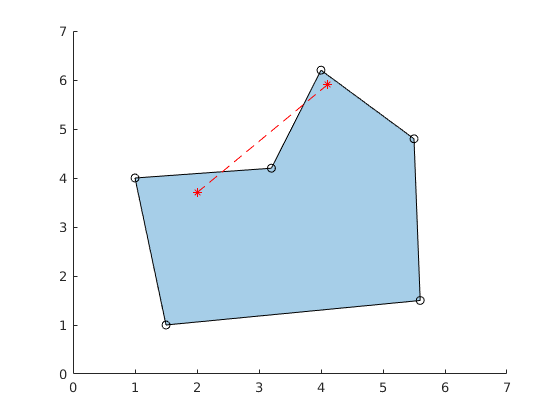
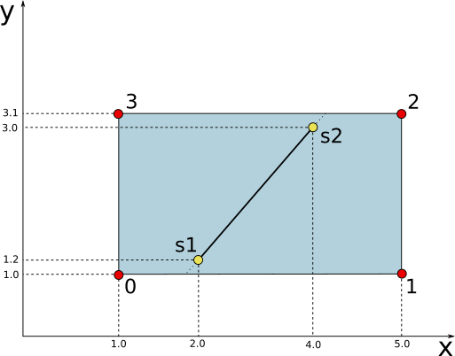
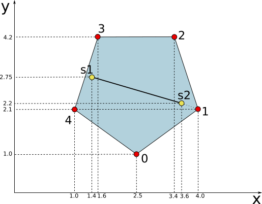

# Project 1 - Polygon Cut

In Computational Science an important task is to cut a polygon in different parts.

The polygon cut problem hides many geometric operation such as:

1. dot and cross product
2. distance between points
3. intersection segment - segment

## Code Requirements

Your group is working on the Computational Science library.

A client wants to use the library and asks for the implementation of a simple function called `CutPolygon`.

The function shall have the following requirements:

* takes in input:
    * `points`: a collection of 2D points in the space
    * `polygonVertices`: a polygon 2D as a collection of vertices indices ordered counterclockwise
    * `segment`: a collection of two 2D vertices representing the segment 2D 
* gives in output:
    * `newPoints`: the collection of resulting new points created concatenated with the original collection
    * `cuttedPolygons`: the resulting N polygons derived from the cutting process as a collection of vertices indices ordered counterclockwise

Moreover:

* Object Oriented Programming (OOP) shall be used
* A Design Pattern shall be used with a proper motivation
* each class and each method shall have a unit test related

### Example

See the image below:



In this case an example of the function call shall be:

```Python
points = { {1.5, 1.0}; {5.6, 1.5}; {5.5, 4.8}; {4.0, 6.2}; {3.2, 4.2}; {1.0, 4.0} }
polygonVertices = { 0, 1, 2, 3, 4, 5 }
segment = { {2.0, 3.7}; {4.1, 5.9} }

[newPoints, cuttedPolygons] = CutPolygon(points, polygonVertices, segment)
```

The resulting cutted polygons shall be like the one depicted in the following image:



```Python
newPoints =  { {1.5, 1.0}; {5.6, 1.5}; {5.5, 4.8}; {4.0, 6.2}; {3.2, 4.2}; {1.0, 4.0}; ... new points... }
cuttedPolygons = { {0, 1, 2, 6, 7, 8, 4, 9, 10, 11}; {6, 3, 8, 7}; {9, 5, 11, 10};  }
```

### Data Visualization

The original polygon, the segment and the resulting polygons can easily visualized in MATLAB with the following code:

```MATLAB
points = [1.5, 1.0;
    5.6, 1.5;
    5.5, 4.8;
    4.0, 6.2;
    3.2, 4.2;
    1.0, 4.0];
polygon = polyshape(points(:, 1),points(:, 2));
segment = [2.0, 3.7;
    4.1, 5.9]; 

figure;
plot(polygon);
hold on;
plot(segment(:, 1), segment(:, 2), 'r--');
hold on;
plot(points(:, 1),points(:, 2), 'ko');
hold on;
plot(segment(:, 1), segment(:, 2), 'r*');
```
which reproduces for example the following plot:



## Documentation Required

The client requires the following documents:

* the UML class diagram with:
    * classes
        * methods
        * attributes
    * relations
* a brief description of all public methods in each class with:
    * what are inputs
    * what are outputs
* the following unit tests:
    1. the rectangle in the following picture:
    
    2. the convex polygon in the following picture:
    
    3. the concave polygon in the following picture:
    
    4. at least one unit test proposed by you with a convex polygon
    5. at least one unit test proposed by you with a concave polygon